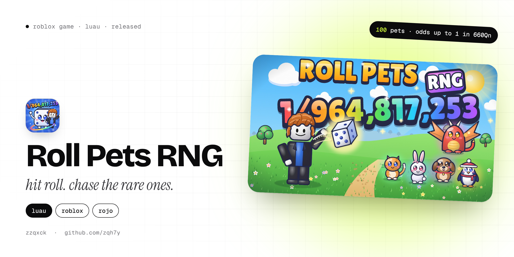

<p align="center">
  
</p>

<p align="center">
  
  
  
  
</p>

# Roll Pets RNG

A solo pet RNG game on Roblox. Hit **ROLL**, see what pet you get, chase the
rare ones and climb the global **Most Rolls** leaderboard.

The whole game is written in code, in Luau, and synced into Roblox Studio with
[Rojo](https://rojo.space). It's released on Roblox, and this README goes
through everything in it.

**At a glance**

- **100 animals**, with odds from 1 in 2 all the way to 1 in 660Qn, and three
  sizes: Normal, Huge (1 in 100, 10x power) and Titanic (1 in 1,000, 100x power).
- **The server rolls first**, and the client only plays the reveal, so a roll
  can't be faked from the player's side.
- **Living enemies**: the coins in every world are characters that jump around,
  and your pets fight them for you.
- Huge and Titanic pulls get a **bush cutscene** before the reveal.
- **Worlds, levels, upgrades and rebirths**, balanced with a Python economy
  simulator (`tools/economy/simulate.py`).
- An **offline test harness** (`tools/sim`) runs the whole server on a mock
  Roblox and plays the game as a fake player, so most bugs are caught before
  Studio is even opened.

## How it plays

**Fight enemies → coins + EXP → level up → hatch pets → stronger team →
upgrades → unlock worlds → rebirth (worlds are kept) → stronger still →
chase Huge and Titanic pets.**

- **Living coins (the enemies):** each world's coins are alive: trees,
  cactuses, ice cubes and sushi with happy faces, 5 in every world at all
  times (a watchdog tops them back up), each with a glowing ring, an outline
  in its world's colour, its name, reward and health bar. Studio's Output
  lists where they are (`[Targets] ...`). They rest, jump, land and rest again (about
  every 3-4 seconds), each world in its own way: trees spring straight up,
  cactuses sway and double-bounce, ice cubes slide and spin, sushi flips.
  Five per area, always on the real ground.
- **Pets fight for you:** equipped pets go after the living coin nearest to
  you in the world you are standing in (never one in another world), all
  together, and hit it on their own. Walk into the next world and they
  switch to its enemies; other worlds' enemies aren't shown. Stronger pets (rarer, bigger)
  hit harder. Hits show lunges, flashes and damage numbers; a broken coin
  bursts and its coins fly into your counter. No clicking needed.
- **Rolling:** the Roll button gives a random animal (100 animals, 1 in 2 to
  1 in 660Qn: 10 animals up to 1 in 1K, then 15 in each band after, 1K-1M,
  1M-1B, 1B-1T and so on) and a random **size**: Normal, Huge (1 in 100, 10x power)
  or Titanic (1 in 1,000, 100x power). **Every animal can hatch in every
  world**, but animals from worlds ahead of the one you stand in are 25x
  rarer per world (a World 4 animal in World 1: 15,625x rarer), and each
  world adds luck (x1 / x1.2 / x1.45 / x1.75), so later worlds hatch better.
- **The hatch:** the server rolls first (each roll is a pet or a luck
  boost, plus the exact luck it used); the screen only shows that result.
  - **The reel** is vertical and sits at the bottom of the screen, by hand
    and on auto: a soft frosted tray (10% opacity), fixed in one spot
    (it never moves during a spin; only the cards inside do), where small
    white cards (the pet on the left, its **complete, exact chance** in a
    pill on the right, e.g. "1 in 12.5K") fall from the top to the bottom
    and ease to a stop on your result. Two little notches on the tray's
    edges mark the middle slot; the card that stops there lifts and takes
    a coloured outline (gold for rare results), then the tray fades away.
    Luck boosts are green cards with a clover. The chances come from the
    same luck, size luck and world the server rolled with
    (`Config.chanceOf`); no rarity names.
  - **Luck boosts** are real results: every roll has a 1 in 12 chance of
    being a **x2 LUCK** instead of a pet. It applies to your next roll and
    is used up by it. Boosts stack by multiplying: hatch x2 → next roll x2;
    hatch another x2 during that roll → next roll x4, then x8, x16 … up to
    x1024. A small clover badge above the Roll, Auto and mode buttons shows it ("×8"):
    filled green while a roll is using it, white with a gold edge while
    it's waiting for your next roll; it pops when it grows and shrinks
    away when it's used up.
  - **Controls:** a big blue **ROLL** button (or the R key) with a slim bar
    that fills while the next roll gets ready, and an **AUTO** on/off button
    (">>" icon) to its left. A hatch can't be skipped. Bigger hatch
    reveals can be turned on in Settings ("Big hatch reveals"). The server keeps the waiting boost in
    your saved data, so rejoining doesn't lose it, and rapid presses can't
    use it twice.
  - **Big hatch reveals** (Settings): a bigger reel with a silhouette moment,
    then a centred reveal where the pet rises large with its name, exact
    chance and power counting up. About 1 full hatch in 30 is a **flex
    roll**: a Huge or Titanic slides past ("Huge Dragon?!"); the reel still
    stops on what you actually rolled.
  - **Huge and Titanic (and any pet 200x rarer than your luck, e.g. 1 in 600B+ with x3B luck): the bush cutscene.** The camera glides onto a bush
    a little ahead of you, the bush rustles harder and harder for about 2
    seconds, then your pet jumps out towards the screen with light and
    sound, and the reveal shows it with its exact chance. Only for a pet
    you really rolled, and only if it makes your team stronger (a Huge that's weaker than every pet you have equipped just gets the normal reveal); it can't be skipped. On auto it plays at
    most once every 90 seconds; in between, a short reveal.
  - **Crazy pulls** (a Mythic or Secret animal) get their own show: dark
    screen, heartbeats with rings of light, rainbow cracks, a flash, then
    "INSANE PULL!" (again only when the pet beats one on your team).
  - Luck has no limit: every multiplier keeps stacking, and with enough luck
    the rarest pets become near-certain (`Config.MAX_LUCK` is only a 1e300
    safety net against numbers too big to handle).

  The ROLL button and AUTO switch sit on their own layer above
  everything, so they always work. Every 10th roll has 2x luck.
- **Feel:** panels fade and rise in, and ease away on close; cards in the
  Inventory and Index grow in one after another; equipping pops the card
  and a soft poof appears where the pet joins (or leaves) your team; a
  rebirth flashes the screen; walking into another world slides a small
  banner with its name down under the HUD. **Settings → Reduced motion**
  turns off bounces, shakes, camera kicks and most confetti.
- **Every animal hatches in every world**: animals from later worlds are
  much rarer in earlier ones (25x per world ahead) but never impossible,
  and no single step of a roll is ever certain (`Config.MAX_HIT`), so even
  huge luck can't make any animal impossible. Index cards show the exact
  chance of your next roll where you stand and say "Hatches in every
  world".
- **Inventory (My Pets):** a dense collection grid of hexagon tiles (about
  5-8 per row, worked out from the space available): the pet, its name, an
  "x3" badge for copies and a green check when equipped; the card's soft
  colour is its rarity. Cards grow a little on hover. Tap one and a details
  panel slides in on the right while the grid stays visible beside it: a
  big preview, name, rarity and size, power, damage per second, the five
  multipliers, how many you have / use, and one Equip / Unequip button.
  Tapping another pet updates the panel in place; X closes it and the grid
  takes the full width again. Tabs: All, Normal, Huge, Titanic, Equipped;
  a small Sort menu: Power, Newest (when you first got it), Rarity.
- **Equip Best** (Inventory and Upgrade Tree): equips the team that really
  deals the most damage (power x Damage upgrade x the pet's own Damage
  stat, `Config.bestTeam`), not just the highest shown power; ties go to
  luck, then coins. It respects your slots, uses copies only as many as
  you own (Normal, Huge and Titanic alike) and drops weaker pets. A small
  toast says what was equipped, or "Team already optimized".
- **Your Team** (top of the screen): each equipped pet in a round chip with
  its damage per second and its share of the team's damage under it
  ("1.2K · 45%"); the shares always add up to 100%.
- **Pet stats:** every animal has its own five multipliers (its `Stats` in
  `Config.PETS`), shown on its Inventory card: **Speed** (how fast it
  moves), **Luck**, **Coins**, **Damage** (its own hits) and **EXP**. Every
  animal has a baseline that grows with rarity plus one specialty (Fox,
  Bunny, Kitsune: luck; Piglet, Hamster, Tanuki: coins; Wolf, Tiger,
  Dragon: damage; Owl, Sphinx, Crane: EXP; Cheetah, Falcon: speed). Huge
  doubles a pet's bonuses and Titanic quadruples them (not Speed). Luck,
  Coins and EXP bonuses of the equipped pets **add up** first:

      pet luck   = 1 + sum of (each equipped pet's Luck - 1)
      final luck = existing luck x pet luck

  where existing luck = Luck upgrade x rebirths x world x 10th-roll bonus x
  luck boost. A 1.1x and a 1.3x pet make 1.4x; with existing luck x5 that
  is x7. Coins and EXP work the same way (team bonus x everything else).
- **Your luck** sits right next to your coins: a small green pill "🍀 ×7.4"
  with exactly the luck your next roll uses (`Config.luck`). Hover or tap
  it for the breakdown (upgrade, pets, rebirths, world, boost, bonus
  roll). It updates the moment you equip a pet, get a boost or walk into
  another world.
- **Upgrade tree** (the tree button): Coins, Damage, Luck, Roll Speed, Rolls
  at Once, Auto Hatch (auto roll → quick reveals → auto-equip best), Size
  Luck and Pet Slots. Some branches unlock after others. It's a scrollable
  board that grows up from START, with rounded connectors that fill with a
  branch's colour once it's unlocked. Each upgrade is a card with its icon,
  "Lv 4 / 20" and a slim bar, and its price always visible in a pill:
  grey padlock + requirement (locked), price (not enough yet), green price
  pill and a gently breathing outline (affordable), gold MAX (maxed).
  Cards lift on hover and press on click; buying squashes and pops the
  card, fills its bar, flashes its connector, bursts sparkles and floats
  "+1 level" up. The side panel shows the selected upgrade in full (now →
  next, level pips, BUY).
- **Collection rewards** in the Index: discovering animals unlocks
  surprise rewards (5, 10, 15 … 70, 85 and 100 animals, the first Huge and Titanic
  animals, and more). A small card under the categories shows how close
  the next one is ("18 / 20 animals"); when one is reached it turns gold,
  the Index button gets a gold dot and a CLAIM button appears. Claiming
  opens a gift that wobbles, pops open and shows exactly what the server
  gave (coins and/or a luck boost that multiplies your waiting boost).
  Each reward can only be claimed once (saved with your data).
- **Pets are chunky collectibles:** every animal is built from soft
  rounded blocks (a big head on a compact body, short sturdy legs) with its
  own silhouette, ears, tail, markings and face (glossy layered eyes,
  cheeks, a nose and its own mouth); paws have toes and chests layered fur.
  Accessories grow with rarity: a collar with a gold tag, a bandana, an
  adventure satchel, a cape, a gem tag with two gold stars circling, soft
  feathered wings, rainbow trim. Huge pets wear gold (collar, paw cuffs,
  badge, gold sparkles); Titanic pets are collector's trophies with a
  jewelled crown, a gold chest plate with a big gem, a royal ermine cape
  and a warm glow.
- **Pets are animals:** every species moves like the real thing. Dogs and
  cats trot with their legs going, bunnies and frogs hop, ducks and penguins
  waddle, birds and dragons fly with flapping wings, fish and whales swim
  through the air, snakes slither, scarabs hover. They follow you at their own
  speed (running to catch up), stay on the ground, and when idle they wag,
  breathe and look around (`Creature.luau`).
- **Inventory and Animal Index:** the Inventory shows the pets you own
  (3D previews, size, rarity, power, amount, equipped) with filters and
  sorting. The Index shows all 100 animals: "X / 100 Animals Discovered",
  NORMAL / HUGE / TITANIC buttons on the right (each with its own count;
  Huge and Titanic don't add to the 100), per-world tabs, silhouettes marked
  ??? for what you haven't found, and each animal's odds where you stand.
- **Living worlds:** birds fly across the sky and land on treetops,
  butterflies and bees visit flowers, wild animals wander and cross the
  paths, leaves and petals fall, flowers and bamboo sway, snow falls and ice
  cracks, sand blows, fireflies glow, and now and then a visitor strolls by
  or stops at the fountain. Each world has its own light. Quiet stretches
  alternate with lively ones, everything is capped, and only the world you're
  in is alive (`Ambient.luau`).
- **Upgrade Board**: every upgrade lives on a real board standing in the
  Forest, right of the path near the spawn (across from the leaderboards),
  like the upgrade walls in incremental games (it replaced the upgrade tree
  screen). A green carpet and wide stairs lead up to a raised stage; walk up and the camera turns to face the board (the red EXIT button at the bottom middle of the screen (clear of the coins and luck), or walking away, gives the camera back). Sections down its left side:
  **Damage** (Damage, Pet Slots), **Coins** (Coins), **Luck** (Luck, Size
  Luck and the six Luck Board rows) and **Rolls** (Roll Speed, Rolls at
  once, Auto Hatch). The top shows the section's total in big numbers; each
  row shows its level, now -> next, a level bar and a BUY button (LOCKED
  with what it needs, MAX when done); a gold dot marks sections with
  something you can buy. The Luck Board rows (Lucky Paw x1.5 a level,
  Four-Leaf Clover x1.5, Golden Horseshoe x1.5, Rainbow x1.65, Lucky Star
  x1.75, Cosmic Fortune x2) each unlock when the one before reaches level
  5, so luck climbs into huge numbers (the cap is x100Qn).
- **Pet odds:** 10 animals in each band of odds: 1-1K (Common), 1K-1M
  (Uncommon), 1M-1B (Rare), 1B-1T (Epic), 1T-1Qd (Legendary), 1Qd-1Qn
  (Mythic) and 1Qn-1Sx (Secret; the rarest, Glitch, is 1 in 540Qn). Luck is
  scaled to match, so you find each band at about the same time as before.
  A pet's power comes from its place in the line-up (not its odds), so
  fights and coins are balanced as before.
- The Index shows how rare each pet really is (its odds at x1 luck),
  whatever your luck.
- **Outfits:** every animal wears its own outfit (looks only): Fireman,
  Cop, Doctor, Rapper, Millionaire, Chef, Pirate, Cowboy, Wizard, Builder,
  Astronaut, Graduate, Party, DJ, Surfer, Viking, Ninja, Santa, Skater,
  Detective, Sailor, Knight, Farmer, Painter, Scientist, Pilot, Baseball,
  Nurse, Explorer, Mechanic, Superhero, Gamer, Gardener, Angel and Devil,
  each in three colourways, so all 100 look different. The Index card and the
  Inventory details say which; a Titanic wears its crown on top of its hat.
- **Pet Aura Machine** (Sahara, where the fusion machine was; step on the
  circle in front of it to open it: it stays open while you stand there and
  closes when you step off, or with the red X): put in 3 of
  the same pet (any size, no aura yet) and get 1 of it back with a random
  **aura: mini bees** flying in circles around it in the aura's colour
  (rarer auras: more bees, rainbow or glowing bees). Each aura multiplies
  that pet's stats:

  | Aura | Chance | Boosts |
  | --- | --- | --- |
  | Worker Bees (2 bees) | 45% | Damage x1.3 |
  | Honey Bees (2) | 25% | Coins x1.4 |
  | Clover Bees (2) | 15% | Luck x1.4 |
  | Plasma Bees (3, glowing) | 9% | Damage x1.8, Coins x1.2 |
  | Rainbow Bees (3, sparkling) | 5% | Damage, Coins, Luck x1.6 |
  | Cosmic Bees (4, big) | 1% | Damage x3, Coins x2.5, Luck x2.5 |

  Aura pets show the aura's name on their tile and over their head, and are
  saved as "Huge Tiger|plasma" (`Config.AURAS`, `Config.petAura`).
- **Levels:** every enemy you defeat gives EXP (1 / 4 / 15 / 50 per enemy in
  worlds 1-4). Levels get steeper (8 x level^1.5 EXP each) and never reset.
  The level and an EXP bar sit under your team; levelling up shows a big
  "LEVEL UP!" with sparkles and a jingle.
- **Rebirth (8 levels):** needs the coins AND a level (16, 34, 52, 64, 70,
  75, 82, 88; the last two cost 16T and 300T coins): the first after about 15 minutes, the 8th after about 2.8 hours. It's a prestige: only your coins reset; worlds, pets,
  upgrades, the Index and your level stay. Each one gives, forever and
  stacking: **Luck x3.8** and **Money +200%** (rebirth 3 = luck x55 and
  coins x7; rebirth 8 = x43K and x17).
- **Leaderboards:** each row shows the player's round avatar next to their
  name. Strongest Pet, Playtime and Rebirths in the Forest;
  Most Rolls in the Top panel.

### Progression (balanced with `tools/economy/simulate.py`)

| | Time for an active player |
| --- | --- |
| Rebirth 1 (level 16) | ~12 min |
| World 2 (Sahara) | ~17 min |
| Rebirths 2 / 3 | ~28 / 52 min |
| World 3 (Frozen Peaks) | ~40 min |
| Rebirths 4 / 5 / 6 | ~1.2 / 1.6 / 1.9 h |
| World 4 (Sakura Jungle) | ~2.2 h |
| Max luck (x100Qn) | ~2.3 h |
| Rebirths 7 / 8 | ~2.5 / 3.4 h |
| World 5 (Lava Arena) | ~3 h |
| Best pet | **Titanic Glitch ~4.8T**, first one at ~2.3 h |

Enemy health, coin rewards, EXP, upgrade costs, world costs and rebirths
all scale together (`python3 tools/economy/simulate.py 3 --hours 10`).

Pet power follows `1M x (PowerOdds / 1000)^1.17` (PowerOdds is the pet's
place in the line-up: Dog ~700, Glitch ~48B), Huge is x10 and Titanic x100.
Luck, Coins and Damage upgrades multiply (x2.4 / x1.35 per level), so they
matter at every stage.

Adding things later is one row each: a pet in `Config.PETS`, a size in
`Config.SIZES` (Giant, Colossal...), an upgrade branch in `Config.UPGRADES`.

## Screen

Coins at the top with YOUR TEAM (equipped pets and damage per second)
under them, colourful navigation down the left (Inventory, Index, Upgrades,
Rebirth, Settings; the leaderboards live in the Forest), and two buttons at
the bottom right in the same sticker style (see "Buttons" below): ROLL a
big icy dice, and AUTO to its left ("AUTO OFF" / green "AUTO ON" with a
status dot); nothing drawn behind them. The compact/full hatch
choice lives in Settings, so the middle stays clear for the fights. The
top-left corner is left for Roblox's own menu buttons.

Every screen shares one friendly collection look: white rounded panels, a
big tilted title in outlined letters over the top-left corner and a big
red X on the top-right one. Pets everywhere are **hexagon tiles**
(`PetTile.luau`): the pet standing on a hexagon in its rarity's colours,
HUGE/TITANIC under it and its odds in big outlined letters ("1 in 430K").
The Inventory shows "3/5 Equipped" with your team's tiles along the top,
then the collection grid. The Index has its info on the left (found
count, categories, rewards) and the hexagon grid on the right; hover or tap
a tile for its card (name, rarity, chance here, power, stats). The upgrade
tree is hexagon nodes on a teal board joined by paths (level badge and
price under each, "?" when locked, gold when maxed); tapping one opens a
card next to it with BUY. A normal roll (and auto) shows one slot per roll at the bottom of the
screen: pets scroll through it from top to bottom (each with its exact
odds and name, slowing down); the pet you got comes down past the middle,
bounces back up and zooms to 150% with light rays, a glow and sparkles in
its rarity's colour behind it, and stays until the next roll; the reel at the bottom is only
used with "Big hatch reveals" on. The luck sign is a green bar
with a clover and "x12.5". Over each pet following you: its odds in big
outlined letters ("1 in 103K") with its name small under them. The rebirth screen shows REBIRTH X / 8 as a segment bar, what
resets vs what you gain, and both requirements as MET / LOCKED with
progress bars. Under the coins a small chip shows your luck ("Luck x2.50
· 2x in 4"). **Auto roll is free.** Settings: damage numbers, full hatch
animation, sounds. Every number uses one short format everywhere
(`Config.formatNumber`): 1.5K, 2M, 3B, 4T, 5Qd, 6Qn, 7Sx ... never long
digit strings. Sounds use built-in Roblox sounds; swap them in
`Effects.SOUNDS`.

## The map

Five compact areas in a straight line along +X (100 x 70 studs each; the fifth is the boss world), with
invisible walls on both sides (|Z| = 37), at both ends and on top. The whole
map is built by `src/server/World` when the server starts, in a bright,
toy-like style: smooth plastic in cheerful colours, with glass and neon
accents (realistic materials are swapped out automatically in `Build.part`).

| Area | What's there | Breakable | Unlock |
| --- | --- | --- | --- |
| 1 Forest | A sandy dirt path winding down the middle, oaks, birches, fruit trees and poplars (root flares, bent trunks, branches, toon-shaded leaves), flower patches (daisies, tulips, bluebells, sunflowers), berry bushes, mushrooms, fallen logs, mossy rocks, two tiered fountains with water streams, a cottage by the right-hand fence, a tall wooden plank fence on both sides, a windmill beyond it, the 3 leaderboards side by side | Hopping fruit trees (5K HP, 20 coins) | Free |
| 2 Sahara | A snake's wavy trail down the middle of the sand towards the next gate with a friendly coiled snake at its end, oasis with palms and reeds, pyramids with gold capstones and a sphinx, Cleopatra's temple (pylon gate with a winged sun disk, lotus columns, painted friezes, obelisks, fire braziers, guardian sphinxes, her statue), the Pet Aura Machine (spinning rings, glowing pipes, hopper, output pad, console with a screen), a camel, pottery, Western Wall-style walls with raised stone faces | Saguaro, barrel and prickly pear cactuses (120M HP, 600 coins) | 25K |
| 3 Frozen Peaks | A frozen lake running down the middle from gate to gate (blue ice, a shine, white cracks), snow with ice patches, a frozen sea (cracks, fishing holes, pressure ridges, floes, icebergs, penguins), walls of big ice blocks with a snow cap on both sides, a snow-brick igloo, a snowman and a sled, an ice arch with icicles, ice walls, crystal clusters, snow-laden pines, snowy rocks, snowfall | Ice cubes: clear, with a fish, with a gem, stacked (30B HP, 40K coins) | 12M |
| 4 Sakura Jungle | The Fuse Machine by the gate in, twisted and weeping cherry trees with falling petals, red maples, bamboo, ferns, hydrangeas and azaleas, a straight stone path down the middle, torii gates, stone lanterns, koi pond with a red arched bridge and a bamboo spout, a five-tier pagoda, Japanese walls with tile roofs and round windows | Sushi with happy faces: salmon, tuna, egg, maki (12T HP, 3M coins) | 130B |
| 5 Lava Arena (boss world) | A round stone arena on warm volcanic rock: sandy fighting floor, ring wall with three rows of stands, torches, orange banners, an entrance arch with a "BOSS ARENA" sign, the Boss Shop (a market stall with a striped awning), little lava pools, dark volcanic rock walls with glowing lava cracks on both sides, smoking volcanoes beyond them, drifting embers | One giant boss, the **Magma Titan** (friendly rock giant with lava cracks; slow heavy stomps; 1Qn HP, 1B coins, 15K EXP); back in the middle 6 s after it's beaten. Pets go for it from anywhere in the area, so it's the AFK world. A boss bar under the level shows its health and your coins a second | 40T |

The Pet Aura Machine turns its rings slowly with sparkles and an orb in
the colour of the rarest aura; walk up and press the prompt to open it.

**Mega Roll pad:** in the Sahara, on the open sand just past the gate (across from the Pet Aura Machine): a pale blue pad with a pile of big dice and potion bottles. The sign over it shows the roll waiting for you, a random big luck multiplier (x1,000 to x100,000, e.g. "x12,000 Roll!", usually a band or two better than a normal roll), and "Claim in 19m 26s". When the timer is done, step on the pad: the roll goes into your Inventory's **Boosts** ("x50,000 Roll"). Use it from there whenever you like: one roll with that luck in the world you stand in (it always hatches a pet) with the full hatch show. Then the pad gets a new multiplier and a fresh 20 minute timer (the first one is ready 8 minutes after joining). Tuned in `Config.MEGA_ROLL`.

**Boost Machine:** in the Frozen Peaks, just past the gate: an icy dispenser with a gift box spinning in its window and a circle in front. Its sign says "FREE BOOST" and when the next one is ready; step on the circle then and a random boost item goes into your Boosts: **x2 Luck** or **x2 Coins** for 10 minutes, or (rarely) **x5 Luck** for 5 minutes. One every 5 minutes (the first a minute after joining). Using a boost of a stat that's already running adds its time. Running boosts show as small chips with their time left in the top-left. (`Config.ITEMS`, `Config.BOOST_MACHINE`)

**The end of World 5:** a friendly wall across the path between two pillars with glowing tops: a blue-to-purple sign with a big smiley, "SEE YOU IN THE NEXT UPDATE!", "More worlds and pets are coming soon ⭐" and "Thanks for playing!", with sparkles drifting off it.

**Cartoon look (graphics-test branch):** the UI uses one round bubbly font, warm cream panels with thick dark outlines, chunky shadows and soft polka dots, and candy-coloured buttons with a darker bottom edge and outlined letters. The worlds: the walkable strip of every world is covered with smooth flat tiles in one single colour per world (bright green Forest, sand Sahara, soft icy-blue Frozen Peaks (white glared too much), fresh green Sakura Jungle, warm dark rock Lava Arena); tiles only go on flat ground, never over the oasis, lava pools or holes (a lighter path and painted details exist in World/init.luau, switched off with FLOOR_PATH / FLOOR_DETAILS). Every terrain material (grass, sand, snow, ice, dirt, rock) is overridden with a flat, untextured version in its bright colour (a MaterialVariant per material), the 3D grass blades are off, surfaces are matte (no shine) with flatter shading, the water is bright turquoise, soft cartoon clouds fill the sky with a bigger sun, and puffy ball-clouds float high up around the edges of the map.

**Coins out of enemies:** while your pets fight, a coin or two pops out of the enemy now and then, and when it breaks a shower of gold coins bursts out (24 for the boss). They fly out in arcs, land on the ground around it, spin and bob. Walk near them and they fly to you; whatever is still lying there after 10 seconds flies to you on its own, and there are never more than 80 on the ground (the oldest come to you first), so it never lags. (The money is paid by the server as before; `client/CoinDrops.luau` is the show.)

**Luck boosts:** the boost waiting for your next roll shows as a small clover badge right next to the luck chip at the top ("×4"), in its own colour: x2 gold, x4 green, x8 cyan, x16 purple, x32 pink, x64 and up orange-red (`Config.boostColor`). When a x2 boost lands on top of one you already have, the roll shows the total (×4, green), not another ×2.

**Player card (bottom left) and YOUR TEAM (right edge):** your level is in the bottom-left corner: a chunky gold LEVEL badge with a white star and outlined white letters next to a thick green EXP bar with a dark cartoon outline. YOUR TEAM (each equipped pet with its DPS and share) is a tall column at the right edge, halfway down, between the AUTO dice (bottom right) and Roblox's player list (top right, Tab: Rolls, Coins and Best, the rarest pet you ever hatched as "1/964.8M", counting Huge/Titanic sizes): the title, the pets one under the other, the team's DPS at the bottom. The top of the screen only has the coins and luck. On phones and tablets (touch, no keyboard) Roblox's joystick takes the bottom-left corner and its jump button the bottom-right, so there YOUR TEAM moves to the top right, the level to the very bottom left, the menu to the top left under Roblox's menu buttons, and the AUTO dice moves up above the jump button (`Hud.layout`). Phones also get a bigger UI scale so text stays readable (`Screen.scaleFor`), big panels and the full reveal shrink to fit the screen (`Screen.fitScale`), and every panel (Inventory, Index, Upgrades, Teleport, ...) opens at 85% of that on phones (`Screen.PHONE_PANEL`), and the UI keeps clear of the notch (DeviceSafeInsets).

**Security:** the server never trusts the client. It decides every roll, hit and reward; every remote checks its arguments (types, ownership, coins, distance, cooldowns) and is wrapped in a per-player rate limit (`server/Security.luau`: spam past a few calls a second is dropped, bad calls never error out). A zone guard puts any character found inside a world the player hasn't unlocked (flying or teleporting past a gate), under the map or above the sky lid back at the start of their last unlocked world.

**Staying in the game:** the Roblox menu's Reset Character button is turned off, and you're never kicked for being AFK: when Roblox notices you've gone idle, the game presses a virtual mouse button for you (`client/Session.luau`), so auto roll and your pets can keep going for as long as you like.

**Pet reveals never block you:** the dark layer behind a reveal lets clicks through, so you can close screens and press buttons while a pet is being shown.

**Fuse Machine:** in the Sakura Jungle, by the gate in on the right: a little blossom shrine with a red-posted blue roof, a glass bubble where a pink core floats inside two spinning rings, a jar of tiny pets going in on the left and a gold pod coming out on the right. Its sign says "100 pets → HUGE · 20 Huge → TITANIC". Step on the pink circle in front and the screen opens: your pets that can go in (Normal and Huge, no aura) with "37 / 100" under each, ready ones first. Pick one and you see it, an arrow down to what it becomes, "You have 37 / 100" with a pink bar, and FUSE. **100 of a Normal pet become 1 Huge of that pet; 20 Huge become 1 Titanic.** The new pet bursts out of the light with its power. Equipped copies that went in come off your team. (`Config.FUSE`, `server/Fuse.luau`, `client/FuseMachine.luau`)

**Boss Shop:** in the Lava Arena by the entrance (where the AFK spot was): a market stall with an orange roof and striped awning, a counter with a sword, a stack of coins, a glowing purple star and a lightning bolt on it, and a "BOSS SHOP" sign. Step on the orange circle in front and the shop opens. Its upgrades only work on bosses and cost coins (kept through rebirths): **Boss Damage** (+50% damage to bosses a level, 25 levels), **Boss Coins** (+50% coins from bosses, 25 levels), **Boss EXP** (+40% EXP from bosses, 20 levels) and **Boss Crits** (+4% chance a hit on a boss does x3 damage, 10 levels). Needs the Lava Arena unlocked. (`Config.BOSS_UPGRADES`, `server/BossShop.luau`, `client/BossShop.luau`)

**Inventory: Pets and Boosts.** Two tabs on the Inventory's top edge. Boosts shows what's running now and a card for each Mega Roll and boost item you have (how many, what it does, a USE button).

**Teleport and Upgrades buttons** (left side): Teleport dims the screen (the game still shows through) and lays every world on it as a tilted photo: a white frame with a real picture of that world from above (its trees, buildings and rocks on its ground), its number and its name. Hover a photo and it straightens and grows; tap an unlocked one to go to its start. Your world has a "YOU'RE HERE" pin; locked worlds are darker with a lock and their price. Tap the dark around them (or X) to close. Upgrades opens the Upgrade Board on screen from anywhere (the same board; it goes back on its stand when you close it).

**Rebirth perks:** one pad in every world: a round pedestal in the perk's colour (gold Coins, green Luck, red Damage, purple EXP) with a glowing ring, a glowing bubble floating over it and a friendly white sign that always faces you (a big icon, the perk's name, what it gives in a coloured pill). A perk is yours for good as soon as you have its number of rebirths (nothing is spent); the sign's bottom pill is grey with "Need 3 rebirths (1/3)" and a bar filling up, then green "Owned":

| World | Rebirths | Perk |
| --- | --- | --- |
| Forest | 1 | Golden Touch: +15% Coins |
| Sahara | 2 | Desert Luck: +50% Luck |
| Frozen Peaks | 3 | Ice Power: +10% Damage |
| Sakura Jungle | 5 | Sakura Wisdom: +25% EXP |
| Lava Arena | 7 | Lava Riches: +25% Coins |

(`Config.PERKS`; the progression simulator counts them.)

**Rolling: one button.** There's no separate ROLL button any more: the big icy dice in the bottom-right corner is the auto-roll switch. Tap it and it keeps rolling ("AUTO ON"; the dice stays white, only its caption changes); tap again to stop ("AUTO OFF"). The cyan bar on top shows when the next roll is ready. On a keyboard, R does the same.

**Props on the ground:** the worlds build their props on Y = 0, but the real ground comes out at about Y 2.0; once the map is built every model standing in the walkable strip (trees, rocks, fountains, the igloo, machines, gates...) is lifted so its lowest visible part rests on the ground (`World.liftProps`), again a moment later when the terrain can be measured.

**Pet levels (Pet Upgrades stand):** in the Forest, on the right next to the spawn: a white stage with three round podiums (blue, gold, pink) under a green "PET UPGRADES" arch. Three of your pets stand on the podiums, turning and bobbing: your team first (each kind once), then your strongest other pets; the arrows under the sign show the next three. Over each pet: its name, "LV 3 / 10" and what the next level gives; in front of it a green button with the price. Click it to level that pet up with coins (every copy of that kind and size; saved in data.PetLevels). Max level 10. Each level: +20% power (level 10 = x2.8), +15% of every stat bonus plus +1% flat, +5% speed. The price grows with the pet's rarity (and size) and doubles each level (`Config.petLevelCost`). The Inventory's details show the level ("LV 3") and the levelled power and stats. (`Config.PET_LEVEL_*`, `server/PetLevels.luau`, `client/PetUpgrader.luau`)

**Step pads:** in front of the Pet Aura Machine, the Boost Machine, the Fuse Machine and the Boss Shop: a low flat platform almost flush with the ground in the machine's colour, with a dark edge, a glowing ring and four white arrows pointing to the middle. Step on it to open that screen (`Build.stepPad`).

**Buttons (sticker style, the user's reference):** no tile or panel behind any of them, just a big glossy cartoon icon with a dark outline and a white shine, and a chunky white name with a thick dark outline over the icon's bottom edge (`client/Sticker.luau`). Each icon is 3D: a darker copy of it sits just under it as its thick edge, with a soft shadow on the ground. Hover grows and tilts the icon, a press squashes it. Left menu (two columns: Inventory | Index, Upgrades | Teleport, Rebirth | Settings): Inventory (an orange backpack), Index (a blue book with a gold star), Upgrades (a big green arrow), Teleport (a purple portal), Rebirth (a gold crown with a red gem), Settings (a grey gear). Right: **ROLL** is an icy white-blue dice with navy pips (a slim cyan bar on its top edge fills while it gets ready), and AUTO to its left is a round badge with ">>" that turns green when it's on.

**Boost zones:** every 5 minutes a big see-through circle with a faint column of light appears in a world where a player is, for 2 minutes. Its sign says what it gives and the time left: "x5 LUCK" (green) or "x3 COINS" (gold), a random x2/x3/x5/x10 (x2 most often, x10 rarely). Stand in it and your luck or coins are multiplied; step out (or let it run out) and they're back to normal. Tuned in `Config.BOOST_ZONE` (`server/BoostZones.luau`).

**Coins while fighting:** every hit pays its share of half the enemy's coins (by the damage it did; a small gold "+123" rises off the enemy), and the kill pays the other half and the EXP. An enemy pays the same in total as before (`Config.FIGHT_PAY`).

**Tutorials:** a new player gets a short tutorial a few seconds after joining: a guide card at the bottom with a bouncing arrow at what to use. 1 tap the AUTO dice to roll (goes on by itself once you've rolled), 2 open your Inventory and Equip Best (once a pet is equipped), 3 walk near the trees, your pets fight for you (once you earn coins), 4 the Upgrade Board (arrow over it), 5 feed the gatekeeper to open a new world (arrow over the camel). NEXT moves on, SKIP ends it. The first time you walk into each new world the camera tours its machines with a caption at each (Sahara: Pet Aura Machine and Mega Roll; Frozen Peaks: Boost Machine; Sakura Jungle: Fuse Machine; Lava Arena: the Magma Titan and the Boss Shop), then comes back; OK/SKIP stops it. Each is shown once per player (data.Seen, `client/Tutorial.luau`).

**Gatekeepers:** beside every gate, on the side you come from, stands a friendly animal of the world behind it: a camel with a patterned saddle blanket, a bridle and a red fez (Sahara), a penguin in a pom-pom beanie and a striped knitted scarf (Frozen Peaks), a red panda with a ringed tail holding a bamboo stick (Sakura Jungle) and a little dragon with back spikes, wings and a glowing ember puff (Lava Arena), each about 9-10 studs tall on a round base in its world's colour with a GATEKEEPER plate. They come alive on your screen: they breathe, look around, tilt their heads and blink, and each has its own moves (the camel swishes its tail, the penguin flaps its flippers, the red panda sways its tail and nibbles its bamboo, the dragon flaps its wings and wags its tail). A yes is two happy hops and a nod; a no is a head shake. The world's price is paid as the animal's food: a watermelon slice for the camel, a fish for the penguin, an apple for the red panda, a chili pepper for the dragon. Walk up and "Feed the Penguin" (its prompt shows the food and the price). With enough coins a short cutscene plays (about 3.5 s): the camera swings over to the animal and its wall, the food flies from you into its mouth, it munches with hearts popping out ("Yum! Thank you! Welcome to the ...!") and hops for joy, the wall glows, shakes and sinks into the ground in a burst of sparkles, and the camera comes back as the gate opens (`Config.GATE_OPEN_DELAY`). Without enough coins it's still hungry ("I'm hungry! A fish costs 50K coins, you need 12K more.") and shakes its head. Once the world is open it stays there as a friendly guard. (`server/World/Gatekeepers.luau`, `server/Progress.luau`, `client/Gatekeeper.luau`)

**Gates:** each gate into the next area is a see-through wall of coloured glass (0.2 opacity) with white rails, and on both sides just the area's price in big gold numbers with a gold coin beside it. The writing goes away when the gate opens. While locked, an invisible wall goes from the ground up to the sky lid, so you can't climb over the gate or jump across from a tree. The camera can zoom out at most `Config.MAX_ZOOM` studs (45), and the place template's Baseplate is removed when the server starts.

**Paths:** the four paths are painted on top of the ground (`World.paintPath`), so they show on any floor; you walk over them and they never get in the way of coins or enemies.

**Testing flags:** `Config.REBIRTH_FREE_FOR_TESTING`, `Config.AREA_COST_FOR_TESTING` and `Config.RELOCK_AREAS_FOR_TESTING` are off in the released game (real rebirth and area costs, saves keep their areas). Saves live in the `RngData_release1` DataStore.

## Solo servers

Every player gets their own server, so it plays like an offline game, but
progress saves and the leaderboard is global. After publishing:
**Game Settings → Places → Server Size = 1**. To test saving and the
leaderboard in Studio: **Game Settings → Security → Enable Studio Access to
API Services**.

## Setup (Rojo)

```bash
aftman install          # installs Rojo 7.7.0
rojo serve              # then connect from the Rojo plugin in Studio
```

## Code

| Path | What it does |
| --- | --- |
| `src/shared/Config.luau` | Pets, rarities, sizes, luck, upgrades, Luck Board, combat numbers, areas, formatting |
| `src/server/PlayerData.luau` | Loading, saving, playtime, sending state to the client |
| `src/server/World/` | Builds the map: `init` (terrain, walls, gates, spawn), `Build` (helpers), one module per area |
| `src/server/Breakables.luau` | Living coins: spawning, hopping, health, rewards |
| `src/server/Combat.luau` | Pets automatically fighting the nearest living coin |
| `src/server/Rolling.luau` | Rolls (pet + size), equipping, Equip Best |
| `src/server/Upgrades.luau` | Buying upgrade levels and Luck Board rows |
| `src/server/Progress.luau` | Area gates and rebirths |
| `src/server/World/Arena.luau` | World 5, the Lava Arena (boss world) |
| `src/client/BossBar.luau` | The boss's health bar and coins a second in the boss world |
| `src/server/Items.luau` | Boost items, the Boost Machine, teleporting |
| `src/client/Boosts.luau` | The Inventory's Boosts section, the Boost Machine's sign, boost timers |
| `src/client/Travel.luau` | The Teleport panel |
| `src/client/Perks.luau` | The rebirth perk pads' status pill and rebirths bar |
| `src/server/BoostZones.luau` | Boost zones: random Luck / Coins circles every 5 minutes |
| `src/server/Aura.luau` | The Pet Aura Machine (3 pets → 1 with a random aura) |
| `src/server/Leaderboards.luau` | The 4 global leaderboards (OrderedDataStores) |
| `src/client/Hud.luau` | Coins, team bar, the icon dock |
| `src/client/Roll.luau`, `Hatch.luau` | Rolling, the luck chip, auto roll; the hatch show |
| `src/client/UpgradeBoard.luau` | The Upgrade Board in the world (every upgrade) |
| `src/client/MegaRoll.luau` | The Mega Roll pad's sign (multiplier, timer) and claiming it |
| `src/client/Rebirth.luau` | The rebirth screen |
| `src/client/Inventory.luau`, `Index.luau`, `PetView.luau` | Inventory, Animal Index, 3D pet previews |
| `src/client/Panels.luau` | Settings, Rebirth (and the old Top panel) |
| `src/client/AuraMachine.luau` | The Pet Aura Machine screen and reveal |
| `src/client/FuseMachine.luau` | The Fuse Machine screen (100 → Huge, 20 Huge → Titanic) and reveal |
| `src/server/Fuse.luau` | Fusing pets into their Huge / Titanic |
| `src/client/BossShop.luau` | The Boss Shop screen (Lava Arena) |
| `src/client/PetUpgrader.luau` | The Pet Upgrades stand by the spawn: your pets on podiums, UPGRADE buttons (pet levels) |
| `src/server/PetLevels.luau` | Levelling pets up with coins (UpgradePet remote) |
| `src/server/BossShop.luau` | Buying boss upgrades |
| `src/client/Living.luau`, `Pets.luau` | Living coins hopping, pets following and attacking |
| `src/client/Creature.luau` | How every animal moves (walk, hop, waddle, fly, hover, swim, slither) |
| `src/client/Ambient.luau` | Birds, critters, butterflies, visitors, falling leaves, weather, swaying plants, lighting per world |
| `src/client/Effects.luau` | Sounds, damage numbers, flying coins, confetti |
| `src/client/Ui.luau`, `Screen.luau`, `State.luau` | UI kit and icons, panels and toasts, the client's data |
| `src/shared/Coins.luau`, `Build.luau` | Living coin looks and jump styles; model-building helpers |
| `src/client/PetModels.luau` | All 100 species (body, features, movement) and the tech details by rarity |
| `tools/sim/` | Runs the server and client on a fake Roblox and plays through a 63-point checklist |
| `tools/economy/simulate.py` | Simulates players to check the progression targets |
